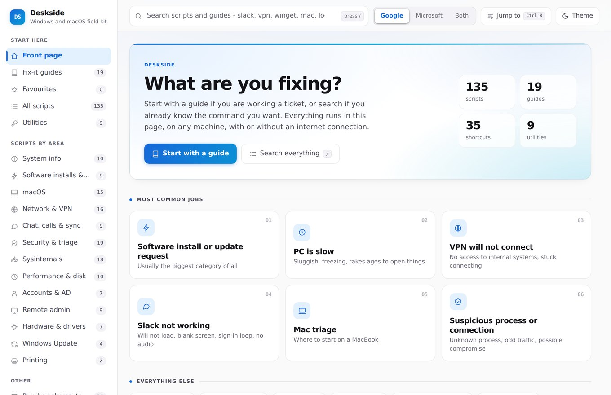
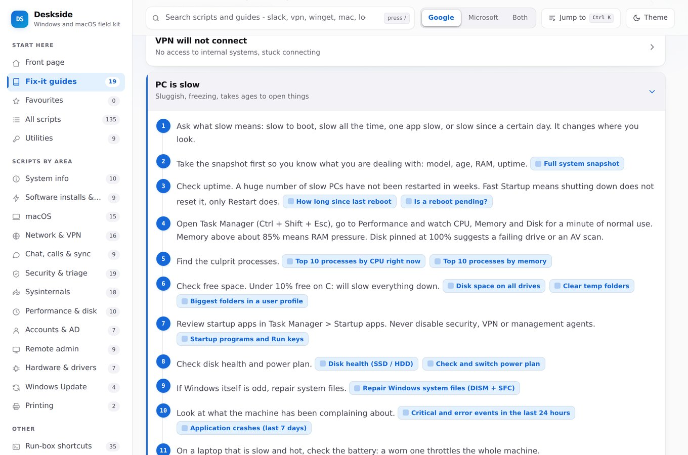
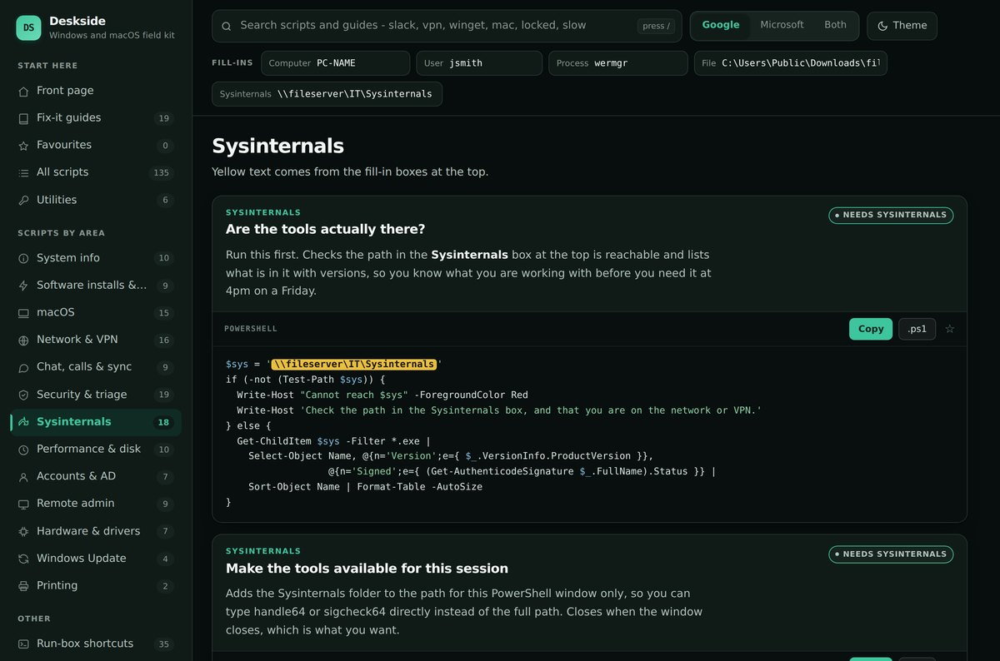
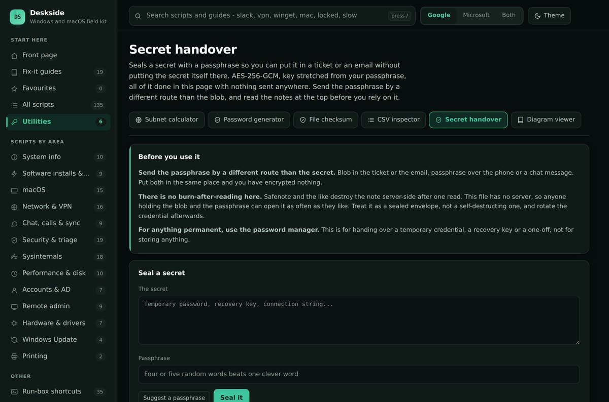

# Deskside
[](https://github.com/zeezmann/deskside/actions/workflows/ci.yml)

A single HTML file that holds everything a service desk engineer reaches for: the
commands, the order to try them in, and a handful of tools that do the job in the
page itself.

No install, no build step, no server, no network. Double-click it, or drop it on a
share and open it from there. It works with the internet unplugged, which matters
because the guide you will want most is the one titled *No internet*.



---

## What is in it

| | |
|---|---|
| **158 scripts** | PowerShell and macOS, each with a plain-English description of what it does and when it lies to you |
| **24 fix-it guides** | Numbered steps in the order an experienced engineer would actually work them |
| **6 utilities** | Subnet calculator, password generator, file checksum, CSV inspector, diagram viewer, encrypted secret handover |
| **35 run-box shortcuts** | The `.msc` and `.cpl` list, click to copy |

Windows and macOS. Google Workspace and Microsoft 365, switchable, so you only
ever see the half that applies to where you work.

### Fix-it guides

Every script is reachable from a guide. Nothing is hidden behind search, because
search only helps people who already know what they are looking for.



### Scripts

Type a machine name or a username into the fill-in boxes and every script on
screen updates. **Copy** gives you the filled-in version, ready to paste.



Badges say what a script will do before you run it. **Makes changes** means it
changes the machine. **Interrupts the user** is the one to watch: it closes their
apps, drops their connection or restarts their machine. Anything without a badge
only reads.

### Secret handover

Seal a password with a passphrase so it can go in a ticket without the password
going in the ticket. AES-256-GCM, key stretched with PBKDF2-SHA256 at 600,000
iterations, fresh salt and IV every time, all of it in the page.



**It is not Safenote.** There is no server here, so there is no burn-after-reading.
Anyone holding the blob and the passphrase can open it as often as they like.
Send the passphrase by a different route than the blob, and rotate the credential
after handover.

---

## Using it

Download `index.html` and open it. That is the whole installation.

Put it on a shared drive if the team wants it, but make it **read-only** for
everyone except two or three named people. Engineers paste commands out of it into
elevated shells, so anyone who can edit that file can run code as administrator on
any machine, at a time of their choosing. Read access for everybody is fine; write
access is not.

Favourites, notes and your fill-in values are kept in your own browser. Nothing is
sent anywhere, ever.

## Making it yours

Three lines at the top of the script block:

```js
const BRAND = {
  mark: 'DS',
  name: 'Deskside',
  sub:  'Windows and macOS field kit'
};
```

`MAINT` sits underneath it. Put your name and a review date in — a shared tool with
no owner rots quietly until somebody runs something that no longer applies.

## Adding your own scripts

Find a line starting with `S(` and copy it:

```js
S('id', 'category', 'Title', ['admin','changes'],
'What it does, and what it will not tell you.',
String.raw`
Get-Something -Interesting
`);
```

Two characters will break the file if they appear in your script: a **backtick**,
which PowerShell uses for line continuation and which ends the block early, and
**`${`**, which the browser reads as its own substitution. Write long commands on
one line, and use `[Environment]::GetEnvironmentVariable('Name')` instead of the
brace form of an environment variable.

## Tests

```bash
npm install
npx playwright install chromium
npm test
```

25 tests, run on every push. They cover the things that would quietly rot:

- the file loads with **zero external requests** — the offline promise, enforced
- every script is reachable from a guide, and no guide points at a script that does not exist
- a fill-in containing an apostrophe still produces valid PowerShell
- the Google / Microsoft switch never leaves a dangling reference in any of its three states
- the encryption round-trips, the same secret seals differently each time, and a
  wrong passphrase or a tampered blob is refused rather than half-decrypted
- the downloaded opener file decrypts on its own, in a clean browser, with no network
- no sideways scroll on a phone

If Chromium is already on the machine and you cannot download another copy:

```bash
PW_CHROMIUM=/path/to/chrome npm test
```

## Licence

MIT. See [LICENSE](LICENSE).
