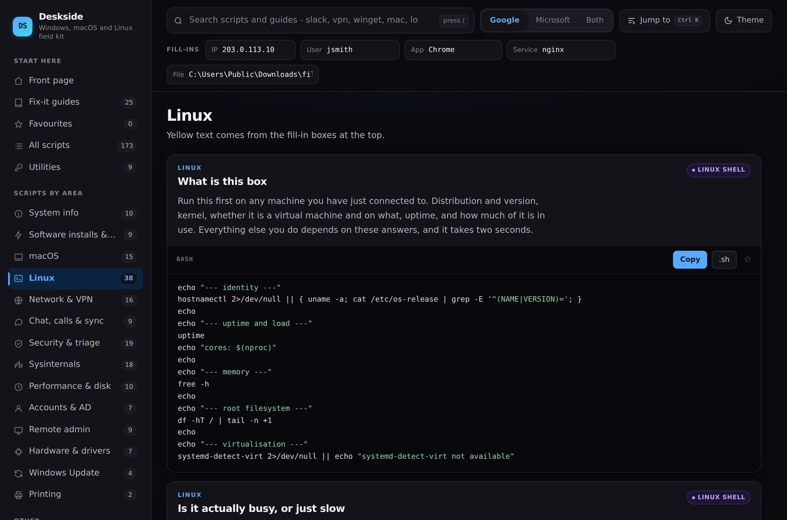
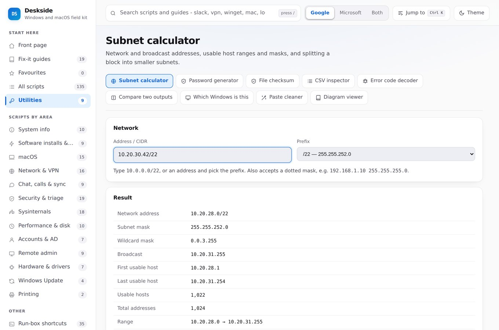

# Deskside

A single HTML file that holds everything a service desk engineer reaches for: the
commands, the order to try them in, and a handful of tools that do the job in the
page itself.

No install, no build step, no server, no network. Double-click it, or drop it on a
share and open it from there. It works with the internet unplugged, which matters
because the guide you will want most is the one titled *No internet*.


---

## What is in it

| | |
|---|---|
| **196 scripts** | PowerShell, macOS and Linux, each with a plain-English description of what it does and when it lies to you |
| **30 fix-it guides** | Numbered steps in the order an experienced engineer would actually work them |
| **9 utilities** | Subnet calculator, password generator, file checksum, CSV inspector, error code decoder, text comparison, Windows build lookup, paste cleaner, diagram viewer |
| **35 run-box shortcuts** | The `.msc` and `.cpl` list, click to copy |

Press **Ctrl+K**, or **Cmd+K** on a Mac, from anywhere to jump to any of it.

Windows, macOS and Linux. Google Workspace and Microsoft 365, switchable, so
you only ever see the half that applies to where you work.

### Linux

38 scripts and six guides for the machine you have just been given a shell on
and know nothing about: triage, disk and inodes, systemd units and their logs,
networking, users and access, packages, and the desktop side.



Where a command forks between distribution families the script works out which
one it is looking at rather than assuming — apt or dnf, ufw or firewalld or
nftables, NetworkManager or netplan or systemd-networkd. A script that assumes
wrong fails in a way that looks like the machine is broken, which is worse than
no script at all.

### Fix-it guides

Every script is reachable from a guide. Nothing is hidden behind search, because
search only helps people who already know what they are looking for.


### Scripts

Type a machine name or a username into the fill-in boxes and every script on
screen updates. **Copy** gives you the filled-in version, ready to paste.


Badges say what a script will do before you run it. **Makes changes** means it
changes the machine. **Interrupts the user** is the one to watch: it closes their
apps, drops their connection or restarts their machine. Anything without a badge
only reads.

### Utilities

Nine tools that do the job in the page rather than handing you a command to run
somewhere else. They work offline like the rest of it, and nothing they touch
leaves the browser.



The ones that earn their place most often: the **error code decoder**, which turns
`0x80070005` into "access denied, and here is which log to open"; **compare two
outputs**, for when you have `ipconfig /all` from the machine that works and the
one that does not; and **which Windows is this**, which turns a build number into
a version and a support date, and tells you how old its own data is rather than
quietly going stale.

---

## Publishing your own copy

[docs/DEPLOY.md](docs/DEPLOY.md) covers pushing it to GitHub, wiring up CI and
putting it on a domain.

## Using it

Download `index.html` and open it. That is the whole installation.

It works on a phone and a tablet as well as a laptop, so it is worth having the
link saved on whatever you are carrying.

Put it on a shared drive if the team wants it, but make it **read-only** for
everyone except two or three named people. Engineers paste commands out of it into
elevated shells, so anyone who can edit that file can run code as administrator on
any machine, at a time of their choosing. Read access for everybody is fine; write
access is not.

Favourites, notes and your fill-in values are kept in your own browser. Nothing is
sent anywhere, ever.

## Making it yours

Three lines at the top of the script block:

```js
const BRAND = {
  mark: 'DS',
  name: 'Deskside',
  sub:  'Windows and macOS field kit'
};
```

`MAINT` sits underneath it with the name shown in the sidebar. Put yours in.

There is deliberately **no review date**. A date nobody moves is worse than no
date: it either announces that the file is unmaintained, or everyone learns to
ignore it. The same reasoning is why the Windows build lookup states what it
covers rather than when it was compiled — a coverage statement stays true,
a freshness stamp does not.

## Adding your own scripts

Find a line starting with `S(` and copy it:

```js
S('id', 'category', 'Title', ['admin','changes'],
'What it does, and what it will not tell you.',
String.raw`
Get-Something -Interesting
`);
```

Two characters will break the file if they appear in your script: a **backtick**,
which PowerShell uses for line continuation and which ends the block early, and
**`${`**, which the browser reads as its own substitution. Write long commands on
one line, and use `[Environment]::GetEnvironmentVariable('Name')` instead of the
brace form of an environment variable.

## Tests

```bash
npm install
npx playwright install chromium
npm test
```

51 tests, run on every push. They cover the things that would quietly rot:

- the file loads with **zero external requests** — the offline promise, enforced
- every script is reachable from a guide, and no guide points at a script that does not exist
- a fill-in containing an apostrophe still produces valid PowerShell
- the Google / Microsoft switch never leaves a dangling reference in any of its three states
- **seven screen sizes from 360px to 1024px, across nine views, with zero
  horizontal overflow** — one grid property once cost 720px of sideways scroll on
  a phone and nothing on a laptop, so this is now asserted rather than eyeballed
- every touch target clears 38px, and the media query that makes that true still matches
- the command palette ranks the obvious answer first
- each utility mounts without error, and the ones with real logic are checked
  against known-good answers rather than themselves

If Chromium is already on the machine and you cannot download another copy:

```bash
PW_CHROMIUM=/path/to/chrome npm test
```

## Licence

MIT. See [LICENSE](LICENSE).
